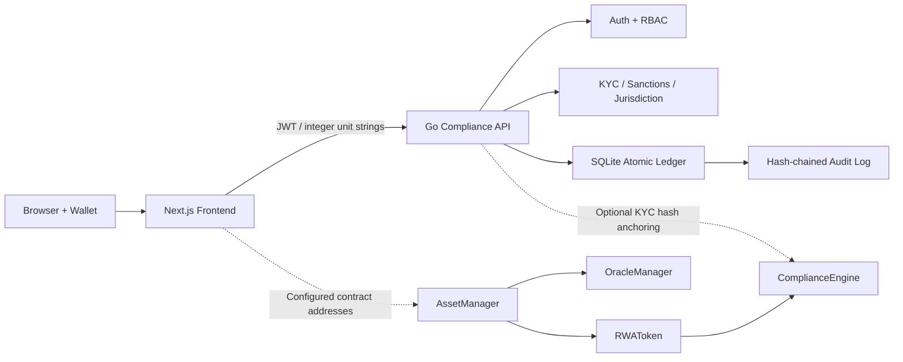

# RWA Compliance Gateway

一个面向 RWA 数字资产发行、合规准入和风险控制的全栈 MVP。项目包含
Next.js 前端、Go API、SQLite 原子账本，以及 ERC-3643-aligned Solidity
合约套件，可用于完整展示身份验证、资产创建、申购、转账、赎回、冻结与审计流程。

> 当前版本适合本地演示、技术验证和安全评审，不代表已经获得 ERC-3643
> 认证，也不应直接承载真实资金或真实世界资产。

## 当前能力

- JWT 身份认证，公开注册固定为 `investor`，防止客户端自助提权
- 后端按 `issuer`、`custodian`、`regulator`、`admin` 执行权威角色校验
- 钱包地址与登录账户绑定，KYC 和资产操作不信任客户端提交的发送方地址
- KYC、制裁名单、司法管辖区和地址合规状态检查
- 全链路最小单位整数字符串金额，前端使用 `BigInt`，后端限制在 `uint256`
- 原子余额变更、请求 Nonce 防重放和 SHA-256 前向哈希审计链
- 按 Token 隔离的 KYC、黑名单、白名单、持仓上限和持有人数量控制
- Hardhat 合约部署与防御性测试

## 架构



项目提供两个明确区分的执行面：

1. 后端 `ledger://` 账本用于无需外部链的确定性 Showcase。
2. Solidity 合约用于展示链上权限发行、合规转账、冻结、增发和赎回。

## 核心目录

```text
backend/
  api/                         HTTP 路由、中间件和安全处理器
  internal/amount/             uint256 兼容金额解析
  internal/database/           SQLite 账本、合规数据和审计链
  internal/services/           认证、KYC、制裁检查和链上锚定
contracts/
  ComplianceEngine.sol         身份、角色、辖区、名单和转账规则
  ComplianceRegistry.sol       合规接口与枚举
  RWAToken.sol                 2 位小数的许可型代币
  AssetManager.sol             资产生命周期和价值/供应量锚定
  OracleManager.sol            受控估值数据
frontend/
  lib/amounts.js               BigInt 金额转换与显示
  lib/contracts.js             ABI 和环境驱动的合约地址
  pages/                       登录、KYC、资产和监管页面
test/contracts/                Hardhat 防御性测试
```

更详细的模块边界与生产上线门槛见
[PHASE4_REFACTOR_BLUEPRINT.md](./PHASE4_REFACTOR_BLUEPRINT.md)。

## 环境要求

- Node.js 18+
- npm 9+
- Go 1.24+
- 支持 CGO 的 C 编译环境，用于 `go-sqlite3`
- MetaMask 或兼容 EIP-1193 钱包，用于前端钱包绑定展示
- 可选：`sqlite3` CLI，用于本地演示角色引导

## 快速启动

### 1. 安装依赖

```bash
npm install
cd frontend
npm install
cd ../backend
go mod download
```

### 2. 配置本地环境

```bash
cd backend
cp .env.example .env
```

至少修改：

```env
JWT_SECRET=<strong-random-secret>
KYC_MODE=demo
SANCTIONS_MODE=demo
DATABASE_URL=./rwa_gateway.db
PORT=8081
ALLOWED_ORIGIN=http://localhost:3000
```

前端配置：

```bash
cd ../frontend
cp .env.example .env.local
```

默认 API 地址为：

```env
NEXT_PUBLIC_API_URL=http://localhost:8081/v1
```

### 3. 启动后端

```bash
cd backend
go run .
```

健康检查：

```bash
curl http://localhost:8081/v1/health
```

### 4. 启动前端

```bash
cd frontend
npm run dev
```

访问 [http://localhost:3000](http://localhost:3000)。

## Showcase 流程

### 投资者流程

1. 使用钱包地址注册，公共注册结果始终为 `investor`。
2. 登录后连接相同钱包地址。
3. 在 KYC 页面提交 Demo KYC 数据。
4. 对已经创建的资产执行申购、转账或赎回。
5. 在资产审计页查看事件哈希与 `integrityVerified`。

### 本地发行方/监管者引导

生产系统必须通过受审计的管理员工作流授予特权角色。本地 Showcase
可在用户完成注册后直接修改本地 SQLite 数据库：

```bash
cd backend
sqlite3 rwa_gateway.db \
  "UPDATE users SET role='issuer' WHERE username='demo_issuer';"

sqlite3 rwa_gateway.db \
  "UPDATE users SET role='regulator' WHERE username='demo_regulator';"
```

角色变更后重新登录以签发包含新角色的 JWT。不要在生产环境使用数据库直改方式。

## 金额模型

资产默认使用 2 位小数。所有 API 金额字段均为已经缩放的十进制整数字符串：

```text
12.34 asset units -> "1234" smallest units
```

禁止向后端发送 `12.34`、JavaScript `number` 或科学计数法。前端
`frontend/lib/amounts.js` 负责将用户输入转换为 `BigInt` 单位；后端拒绝负数、
小数、零值和超过 `uint256` 的金额。

## 关键 API

除注册、登录和健康检查外，以下接口均要求：

```http
Authorization: Bearer <jwt>
```

| 方法 | 路径 | 角色/条件 |
|---|---|---|
| POST | `/v1/auth/register` | Public，固定创建 investor |
| POST | `/v1/auth/login` | Public |
| POST | `/v1/compliance/verify` | Authenticated，使用 JWT 钱包地址 |
| GET | `/v1/compliance/status` | Authenticated |
| GET/POST | `/v1/compliance/sanction-list` | Regulator |
| POST | `/v1/compliance/jurisdiction` | Regulator |
| PUT | `/v1/compliance/jurisdiction/restrict` | Regulator |
| POST | `/v1/assets/create` | Issuer |
| POST | `/v1/assets/deposit` | Authenticated + KYC + sanctions check |
| POST | `/v1/assets/redeem` | Authenticated + KYC + sanctions check |
| POST | `/v1/assets/transfer` | Sender/recipient KYC + sanctions check |
| POST | `/v1/assets/freeze` | Custodian or Regulator |
| POST | `/v1/assets/unfreeze` | Custodian or Regulator |
| POST | `/v1/assets/deactivate` | Regulator |
| GET | `/v1/assets/audit-trail?assetId=...` | Authenticated |

资产写操作示例：

```json
{
  "assetId": "demo-asset-1",
  "amountUnits": "1250",
  "toAddress": "0x2222222222222222222222222222222222222222",
  "nonce": "transfer-20260610-001"
}
```

发送方地址由 JWT 推导，客户端传入的 `fromAddress` 不参与授权。

## 智能合约

### 本地测试

```bash
npm test
```

当前防御性测试覆盖：

- 非授权 KYC、角色、铸币和持有人状态写入
- 未注册 Token 绕过和跨 Token 状态污染
- 黑名单、KYC、白名单、暂停和账户持仓上限
- 2 位小数最小单位、Allowance 与精确余额
- 资产创建、估值/供应量同步、申购、转账、赎回和冻结

### 本地部署

```bash
npx hardhat run scripts/deploy.js --network hardhat
```

脚本会部署并配置：

- `ComplianceEngine`
- `OracleManager`
- `AssetManager`
- Demo `RWAToken`

### Sepolia

根目录 `.env` 示例：

```env
SEPOLIA_URL=<rpc-url>
PRIVATE_KEY=<dedicated-deployer-private-key>
ETHERSCAN_API_KEY=<optional>
```

```bash
npm run deploy:sepolia
```

不要提交私钥，也不要将资金托管密钥作为 KYC 锚定或部署账户。

## 可选链上 KYC 哈希锚定

后端配置以下变量后，会使用专用 Relayer 对 `setKYCDataHash` 发起真实签名交易：

```env
RPC_URL=<rpc-url>
ANCHOR_PRIVATE_KEY=<dedicated-relayer-private-key>
COMPLIANCE_ENGINE_ADDRESS=<deployed-address>
```

未配置时，本地 Demo KYC 仍可完成，但不会伪造链上交易成功。

## 验证

```bash
cd backend
GOCACHE=/tmp/rwa-go-cache go test ./...
GOCACHE=/tmp/rwa-go-cache go vet ./...

cd ..
npm test
npx hardhat run scripts/deploy.js --network hardhat

cd frontend
npm run build
```

截至 2026-06-10：

- Go 测试与 `go vet` 通过
- Hardhat：10 个合约测试通过
- Hardhat 本地完整部署通过
- Next.js 生产构建通过
- 注册页桌面与 390 x 844 移动端响应式检查通过

## 安全与生产边界

生产上线前至少需要：

1. 使用 SIWE challenge/response 替代仅账户密码与钱包地址绑定。
2. 接入持牌 KYC 和制裁筛查供应商，禁止 `demo` 模式。
3. 使用 HSM/KMS 托管 JWT、Relayer 和部署密钥。
4. 完成标准 ERC-3643 互操作评审和独立智能合约审计。
5. 完成应用渗透测试、数据库备份、日志留存和 SIEM 导出。
6. 建立受审计的角色授予、双人复核和紧急响应流程。

详见 [security_audit_report.md](./security_audit_report.md)。

## License

MIT
