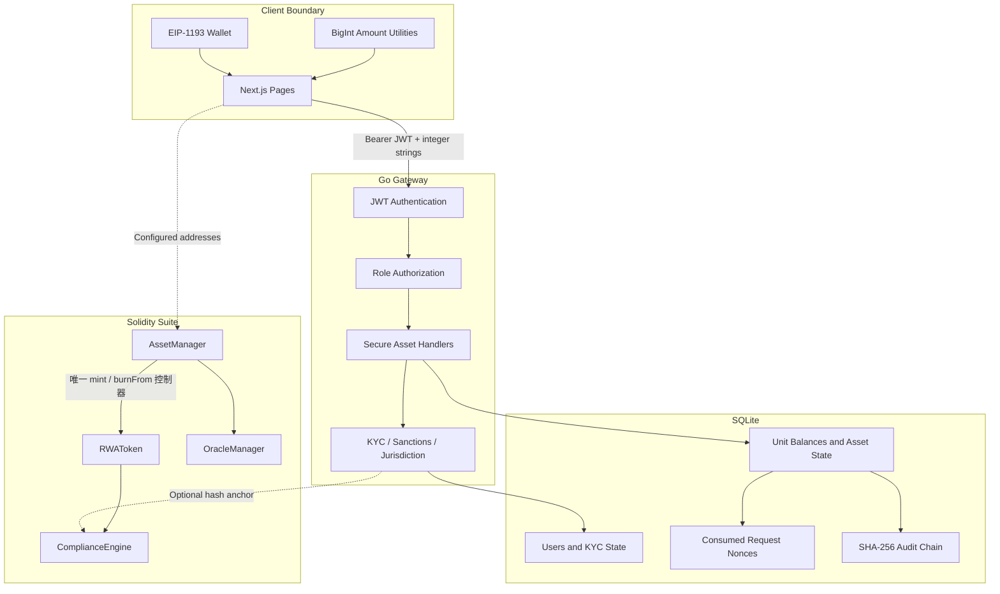

# RWA Compliance Gateway 项目全景图

更新日期：2026-06-12

## 产品边界

该项目是一个 ERC-3643-aligned RWA 合规网关 MVP，目标是完整展示：

1. 用户注册、登录与钱包绑定。
2. KYC、制裁地址和司法管辖区控制。
3. 发行方创建资产。
4. 合规用户申购、转账和赎回。
5. 托管方或监管者冻结资产。
6. 后端审计链和 Solidity 事件形成可核验操作证据。

系统不是完整的生产级托管、支付、法币清结算或法律权属登记平台。

## 组件关系



## 信任边界

| 边界 | 不可信输入 | 权威校验 |
|---|---|---|
| Browser -> API | 地址、角色、金额、Nonce | JWT、RBAC、格式和 uint256 校验 |
| Wallet -> UI | 当前连接账户 | 必须与登录用户地址一致 |
| API -> Database | 余额变更和状态变更 | 单事务、Nonce 唯一约束、审计哈希 |
| Token -> ComplianceEngine | 持有人状态更新 | 仅已注册 Token 可调用 |
| Issuer -> AssetManager | 创建、入金、赎回 | AssetManager 业务权限与 KYC |
| AssetManager -> Token | mint、burnFrom | Token immutable supplyController |
| Operator -> ComplianceEngine | KYC、名单、冻结 | 按资产 Manager 或 Regulator 权限 |
| External Provider -> API | KYC/制裁结果 | 超时、配置检查和失败处理 |

## 数据流

### 认证

```text
Register -> investor role -> Login -> signed JWT
JWT claims -> middleware -> address/role context -> route authorization
```

公共注册忽略客户端提交的角色。特权角色必须通过受控运维流程授予。

### KYC

```text
Wallet match -> JWT address -> KYC provider/demo verification
-> store desensitized data hash -> mark verified
-> optional signed on-chain hash anchoring
```

### 资产账本

```text
Request -> validate integer units -> sanctions/KYC check
-> consume nonce + mutate balances + append audit event
-> commit one SQLite transaction
```

任何一步失败都会回滚整个操作。

### 合约转账

```text
RWAToken.transfer
-> ComplianceEngine.isTransferAllowed(token, from, to, amount)
-> KYC + blacklist + jurisdiction + whitelist + limits
-> token balance update
-> holder state hook
```

### 合约发行与赎回

```text
Issuer/Investor -> AssetManager
-> update asset value and internal token units
-> RWAToken mint/burnFrom (only supplyController)
-> verify totalValue == totalTokens == totalSupply
```

全局 Issuer、Admin 和普通持有人都不能绕过 `AssetManager` 直接改变供应量。

## 核心安全不变量

1. 客户端不能通过注册或请求体授予自己特权角色。
2. 资产操作人始终来自已验证 JWT。
3. 金额始终使用最小单位无符号整数字符串。
4. 金额不能超过 Solidity `uint256`。
5. 同一请求 Nonce 只能消费一次。
6. 余额、Nonce 和审计记录必须原子提交。
7. 每个审计事件包含前一个事件哈希。
8. 合约合规状态按 Token 隔离。
9. 只有已注册 Token 能更新持有人状态。
10. 冻结、KYC、名单、角色和资产配置写入受角色保护。
11. 每个 Token 只能由其 immutable `supplyController` 改变供应量。
12. 当前 1:1 模型下，`totalValue == totalTokens == token.totalSupply()`。

## 部署形态

### 本地 Showcase

- Next.js：`localhost:3000`
- Go API：`localhost:8081`
- SQLite：`backend/rwa_gateway.db`
- KYC/制裁：显式 `demo` 模式
- 链：可选 Hardhat 临时网络

### 生产目标

- 前端静态/Node 托管与 TLS
- Go API 多实例部署
- PostgreSQL 或受管关系数据库
- Redis/网关级分布式限流
- SIWE 和短期会话
- 持牌 KYC/AML 数据源
- HSM/KMS 和专用 Relayer
- 标准 ERC-3643 合约套件与独立审计
- 集中审计日志、告警和灾备

## 文档索引

- [README.md](./README.md)：安装、启动和演示入口
- [PHASE4_REFACTOR_BLUEPRINT.md](./PHASE4_REFACTOR_BLUEPRINT.md)：模块边界与生产门槛
- [security_audit_report.md](./security_audit_report.md)：当前风险结论
- [COMPLETE_TEST_CASE.md](./COMPLETE_TEST_CASE.md)：自动化验证矩阵
- [development_log.md](./development_log.md)：本轮重构记录
